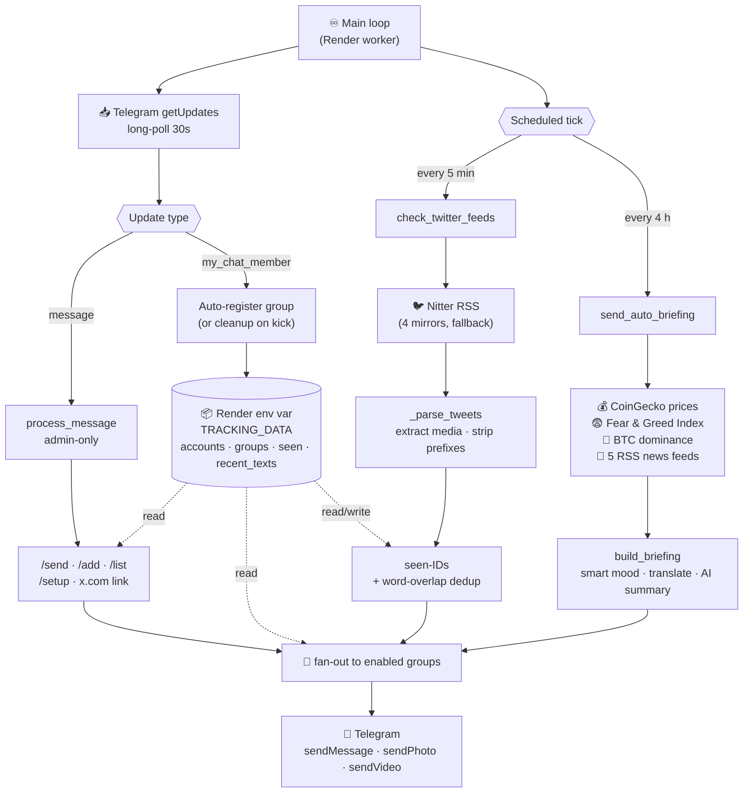

# ⚡ Crypto News Bot

Telegram bot that sends crypto market briefings in Hebrew, every 4 hours, 100% free.

## What It Does

Every 4 hours, this bot automatically:
1. Fetches live prices from CoinGecko (BTC, ETH, SOL, BNB, XRP)
2. Scrapes headlines from 5 crypto news sources via RSS
3. Translates everything to Hebrew using Google Translate
4. Sends a formatted briefing to your Telegram

## Stack

| Component       | Service              | Cost |
|----------------|----------------------|------|
| News Sources   | RSS (CoinDesk, CoinTelegraph, Bitcoin Magazine, The Block, Decrypt) | $0 |
| Prices         | CoinGecko free API (no key needed) | $0 |
| Translation    | Google Translate (free, no key) | $0 |
| Delivery       | Telegram Bot API | $0 |
| Scheduler      | GitHub Actions (2,000 min/month free) | $0 |
| Dependencies   | None (Python stdlib only) | $0 |
| **Total**      |                      | **$0/month** |


## How It Works



The bot runs as a single Python worker on Render. The main loop interleaves Telegram long-polling with two scheduled jobs (Twitter check every 5 min, briefing every 4 h). State persists across deploys by writing `TRACKING_DATA` back to a Render env var via the Render API.

## Project Structure

```
crypto-news-bot/
├── .github/workflows/
│   └── crypto-news.yml      # Schedule (cron) + run config
├── src/
│   └── main.py              # Pipeline: RSS → CoinGecko → Translate → Telegram
├── BOT-CONTROLS.sh          # Stop/resume/delete commands
├── .gitignore
└── README.md
```


## Security

- **Private repo** — no one can see the code
- **Encrypted secrets** — Bot Token & Chat ID are encrypted in GitHub
- **One-way bot** — sends messages only to your Chat ID, no incoming commands
- **No API keys needed** — RSS, CoinGecko, Google Translate are all keyless

## Customization

### Change Schedule
Edit `.github/workflows/crypto-news.yml`:
```yaml
schedule:
  - cron: '0 */4 * * *'     # every 4 hours (default)
  - cron: '0 */2 * * *'     # every 2 hours
  - cron: '0 8,14,20 * * *' # 3x per day
  - cron: '0 */1 * * *'     # every hour (uses more free minutes)
```

### Add Coins
Edit `COINS` and `COIN_SYMBOLS` in `src/main.py`:
```python
COINS = "bitcoin,ethereum,solana,binancecoin,ripple,dogecoin,cardano"
COIN_SYMBOLS = [
    ("bitcoin", "BTC"), ("ethereum", "ETH"), ("solana", "SOL"),
    ("binancecoin", "BNB"), ("ripple", "XRP"),
    ("dogecoin", "DOGE"), ("cardano", "ADA"),
]
```

### Add News Sources
Edit `RSS_FEEDS` in `src/main.py`:
```python
RSS_FEEDS = [
    {"name": "CoinDesk",  "url": "https://www.coindesk.com/arc/outboundfeeds/rss/"},
    {"name": "NewSource", "url": "https://example.com/rss"},
]
```


## Bot Controls

### Stop the bot
```bash
gh workflow disable crypto-news.yml --repo aviniazov7/crypto-news-bot
```
Or: GitHub → Actions → Crypto News Briefing → ⋯ → Disable workflow

### Resume the bot
```bash
gh workflow enable crypto-news.yml --repo aviniazov7/crypto-news-bot
```
Or: GitHub → Actions → Crypto News Briefing → Enable workflow

### Run manually (one time)
GitHub → Actions → Crypto News Briefing → Run workflow → Run workflow

### Delete everything
```bash
gh repo delete aviniazov7/crypto-news-bot --yes
```

## Usage (free tier)

| Metric             | Value                   |
|--------------------|-------------------------|
| Minutes per run    | ~0.5 min                |
| Runs per day       | 6 (every 4 hours)       |
| Minutes per month  | ~90 min                 |
| Free limit         | 2,000 min/month         |
| Headroom           | 1,910 min left for other projects |
